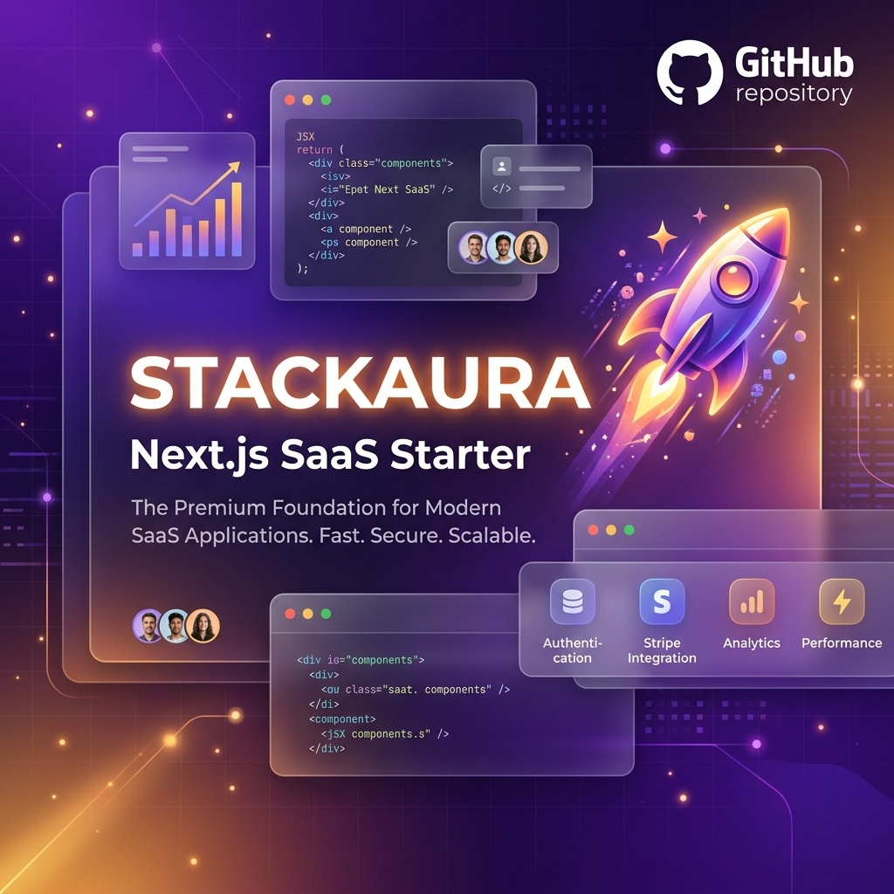

# 🚀 Next.js SaaS Starter (Español)
### El boilerplate definitivo para lanzar tu próximo producto SaaS en tiempo récord.

---

## 🛠️ Tecnologías
- **Next.js 15+** (App Router)
- **Tailwind CSS** (Diseño moderno y responsivo)
- **Supabase/Prisma** (Base de datos potente)
- **Stripe** (Suscripciones listas para usar)

---

### 🔗 Mantente Conectado
- **Sitio Web:** [stackaura.com](https://www.stackaura.com/)
- **LinkedIn:** [Ahmar Hussain](https://www.linkedin.com/in/ahmar204/)
- **GitHub:** [@RanaAhmar](https://github.com/RanaAhmar)

---

### 🌟 Parte del ecosistema [Stackaura](https://github.com/RanaAhmar)
*Empoderando a los desarrolladores con herramientas automatizadas y soluciones de alto rendimiento.*

**Explora más:**
- 🚀 [Todos los Proyectos](https://github.com/RanaAhmar?tab=repositories)
- 🛠️ [Consejos Diarios de Programación](https://github.com/RanaAhmar/daily-coding-tips)
- 📊 [Dashboard del Perfil](https://github.com/RanaAhmar/RanaAhmar)

*¡Si encuentras este proyecto útil, por favor considera darle una estrella! ⭐*
